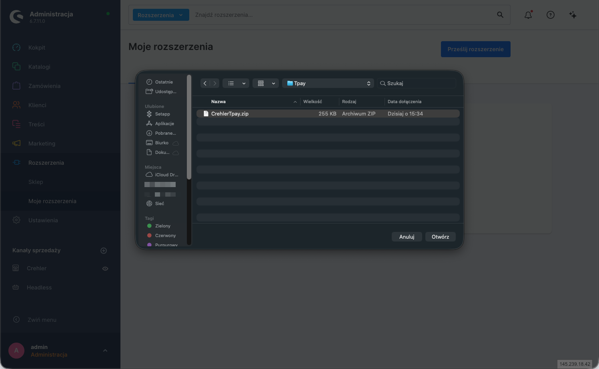

<p align="center">
  
</p>

<h1 align="center">Instrukcja instalacji</h1>

<p align="center">Wtyczkę <strong>Bramka płatności Tpay by CREHLER</strong> zainstalujesz na dwa sposoby: przez Composer albo z paczki ZIP.</p>

---

## Wymagania

| Komponent | Wersja |
|---|---|
| Shopware | 6.6.x lub 6.7.x |
| PHP | 8.2, 8.3, 8.4 lub 8.5 |
| Konto Tpay | aktywne, z dostępem do **Open API** |
| Waluta | sklep musi obsługiwać **PLN** |

---

## Metoda 1 — Composer (zalecana)

**1. Zainstaluj wtyczkę:**

```bash
composer require crehler/tpay
```

**2. Aktywuj w Shopware:**

```bash
bin/console plugin:refresh
bin/console plugin:install --activate CrehlerTpay
bin/console cache:clear
```

**3.** Wtyczka pojawi się w **Rozszerzenia → Moje rozszerzenia** jako *„Bramka płatności Tpay by CREHLER"*.

➡️ Przejdź do **[Instrukcji konfiguracji](konfiguracja.md)**.

---

## Metoda 2 — Paczka ZIP

**1.** Pobierz wtyczkę **[CrehlerTpay.zip](https://github.com/crehler/tpay/releases/latest/download/CrehlerTpay.zip)**.

**2.** W **Rozszerzenia → Moje rozszerzenia** kliknij **„Prześlij rozszerzenie"**.


**3.** Potwierdź ostrzeżenie o rozszerzeniu spoza Sklepu Shopware — kliknij **„potwierdź"**.


**4.** Wskaż pobrany plik **`CrehlerTpay.zip`**.



**5.** Wtyczka pojawi się na liście jako *„Bramka płatności Tpay by CREHLER"* — kliknij **„Zainstaluj"**, a następnie **„Aktywuj"**.


➡️ Przejdź do **[Instrukcji konfiguracji](konfiguracja.md)**.

---

## Wsparcie

Problem z instalacją? Napisz do nas: **[support@crehler.com](mailto:support@crehler.com)**

<p align="center"><sub>Bramka płatności <strong>Tpay by CREHLER</strong> · <a href="https://crehler.com/">crehler.com</a></sub></p>
