

  

<h1 align="center">Tpay dla Shopware 6 — instrukcja konfiguracji</h1>

Bramka płatności Tpay by CREHLER — krok po kroku: od danych z panelu Tpay po gotowe płatności w sklepie.

---

> ℹ️ Instalację wtyczki (Composer lub ZIP) opisuje **[Instrukcja instalacji](instalacja.md)**. Ten dokument zakłada, że wtyczka jest już zainstalowana i aktywna.

---

## Zanim zaczniesz

Potrzebujesz:

- **aktywnego konta Tpay** z dostępem do **Open API** (do płatności produkcyjnych) lub **konta sandbox** (do testów),
- sklepu Shopware z kanałem sprzedaży obsługującym walutę **PLN**,
- zainstalowanej i aktywnej wtyczki **Bramka płatności Tpay by CREHLER**.

> 💡 **Najpierw testy.** Zalecamy skonfigurowanie i przetestowanie płatności na danych **sandbox**, a dopiero potem przełączenie na produkcję.

---

## Krok 1 — Pobierz dane z panelu Tpay

Zaloguj się do panelu Tpay ([panel produkcyjny](https://panel.tpay.com/) lub panel sandbox) i zbierz cztery wartości. Wszystkie znajdziesz w panelu — poniżej dokładne ścieżki.

### 1a. Client ID i Secret (klucze Open API)

Panel Tpay → menu **Integracje → API**. Na liście kluczy Open API znajdziesz **Client ID** oraz **Secret** — skopiuj obie wartości. Jeśli nie masz jeszcze żadnego klucza, utwórz go przyciskiem **„Dodaj nowy klucz"**.

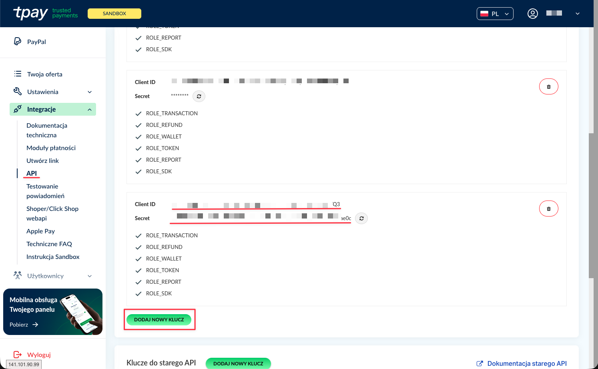

### 1b. Kod bezpieczeństwa powiadomień

Panel Tpay → menu **Ustawienia → Powiadomienia**. W karcie **„Zabezpieczenia"** skopiuj **Kod bezpieczeństwa**.

To pole jest **wymagane** — standardowe powiadomienia o płatności Tpay są weryfikowane sumą kontrolną MD5 z użyciem tego kodu. Bez niego potwierdzenia płatności są odrzucane, a zamówienia pozostają nieopłacone.

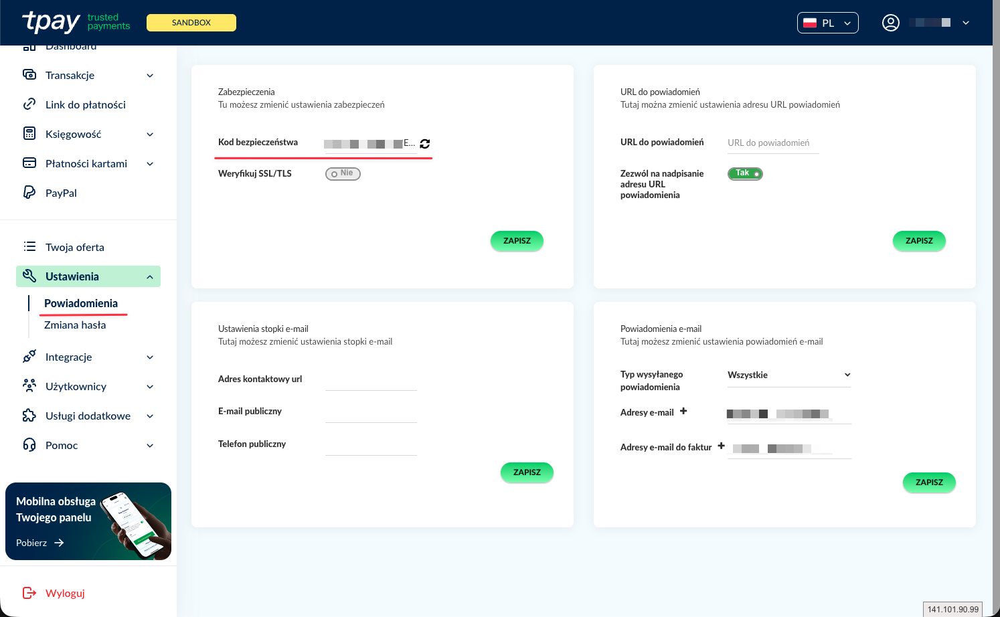

### 1c. Klucz publiczny Cards API (opcjonalnie)

Potrzebny **tylko**, jeśli zamierzasz osadzić formularz karty w checkout (patrz **Krok 4 — Konfiguracja płatności kartą**). Znajdziesz go na **tej samej stronie co klucze API** (**Integracje → API**) — przewiń na sam dół do karty **„Cards API"** i skopiuj **klucz publiczny** (base64).

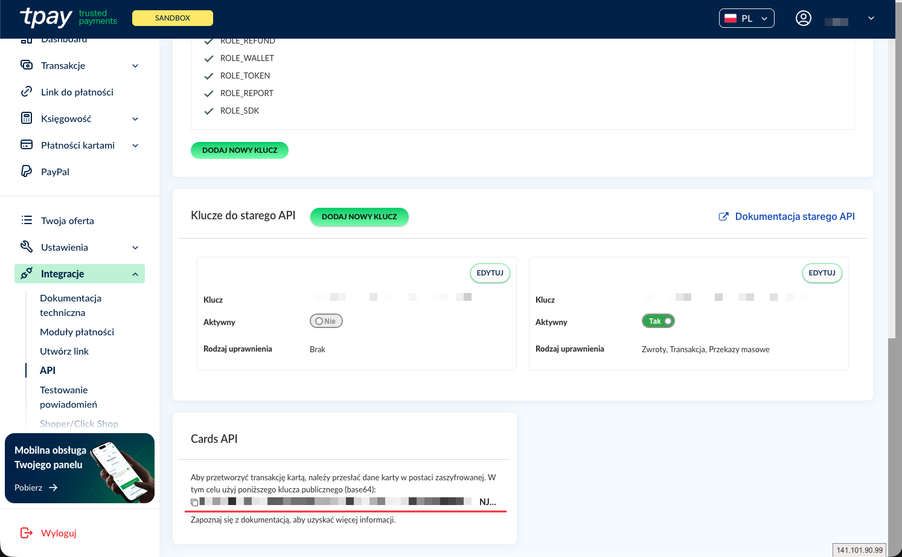

> 🧪 **Sandbox:** te same trzy ekrany istnieją w panelu sandbox Tpay i dają osobne wartości (Client ID / Secret / kod bezpieczeństwa / klucz Cards API). Wpisuje się je w osobną kartę „Dane sandbox" w konfiguracji wtyczki.

---

## Krok 2 — Wpisz dane w konfiguracji wtyczki

W panelu Shopware przejdź do **Rozszerzenia → Moje rozszerzenia**, znajdź **Bramka płatności Tpay by CREHLER** (musi być włączona — przełącznik po lewej) i kliknij **„Skonfiguruj"**.

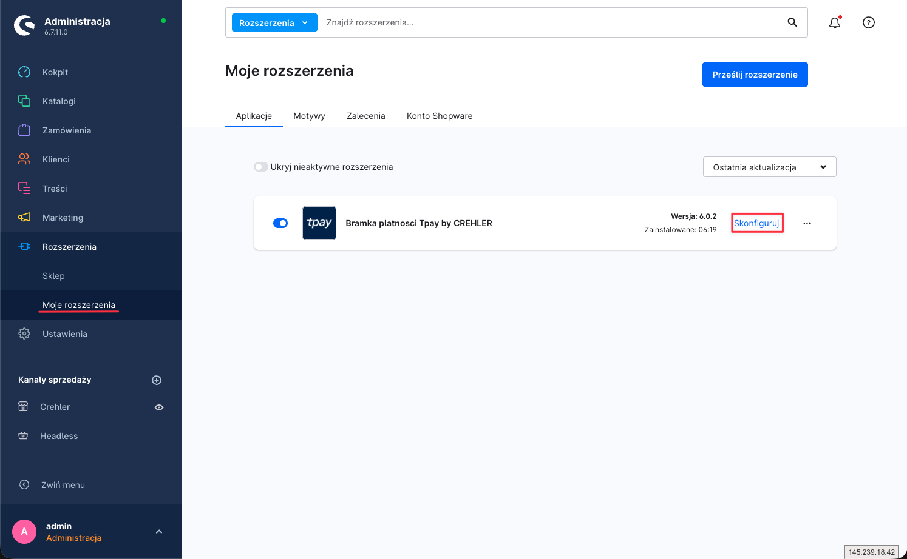

### 2a. Dane produkcyjne

Wypełnij kartę **Dane produkcyjne** wartościami z **Kroku 1**:

| Pole w konfiguracji | Wartość z panelu Tpay |
|---|---|
| **Client ID** | Client ID (Klucze Open API) |
| **Client Secret** (w panelu: „Secret") | Secret (Klucze Open API) |
| **Kod bezpieczeństwa powiadomień** | Kod bezpieczeństwa (Powiadomienia → Bezpieczeństwo) |
| **Klucz publiczny Cards API** | klucz publiczny Cards API *(opcjonalnie — tylko dla osadzonego formularza karty)* |

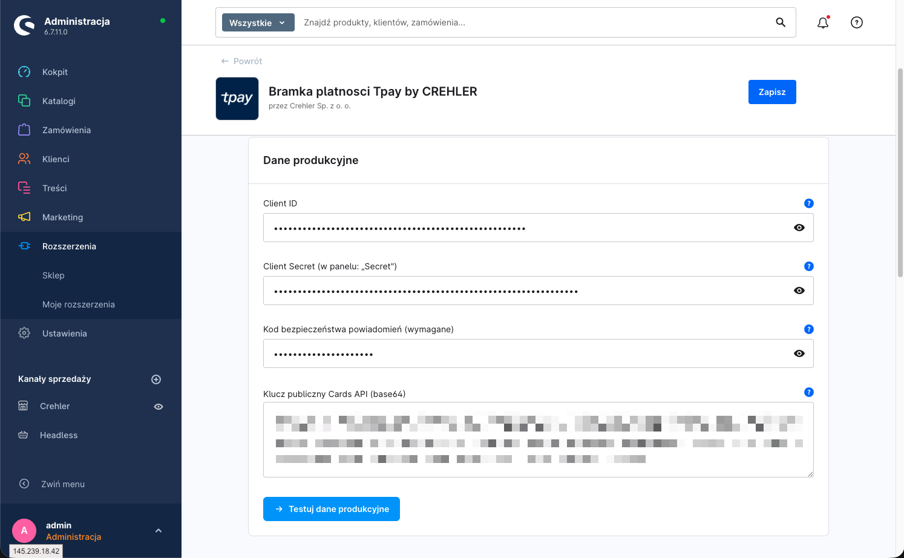

> ⚠️ **Wybór kanału sprzedaży.** U góry konfiguracji znajduje się przełącznik kanału sprzedaży. Ustawienia możesz zapisać globalnie („Wszystkie kanały sprzedaży") lub osobno dla wybranego kanału. Jeśli korzystasz z kilku kanałów z różnymi kontami Tpay — ustaw dane per kanał.

### 2b. Dane sandbox (do testów)

Aby płacić na koncie testowym, włącz **Tryb sandbox** i wypełnij kartę **Dane sandbox** danymi z panelu sandbox. Gdy tryb sandbox jest włączony, wtyczka używa danych sandbox zamiast produkcyjnych.

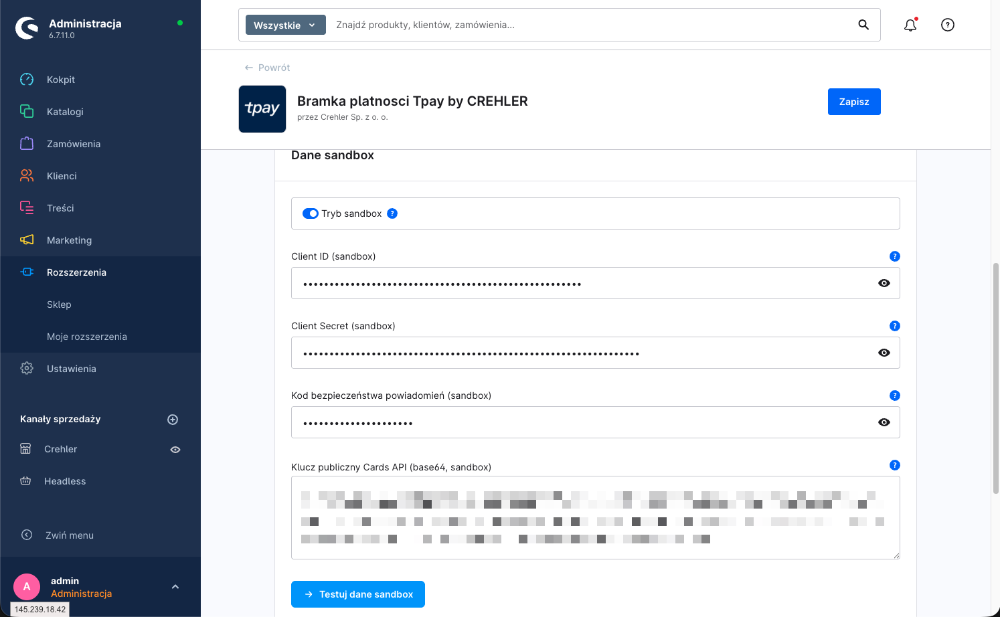

### 2c. Przetestuj dane

Pod każdą kartą znajduje się przycisk testu: **„Testuj dane produkcyjne"** oraz **„Testuj dane sandbox"**. Kliknij właściwy po wpisaniu danych — wtyczka połączy się z Tpay i potwierdzi, że klucze są poprawne. Na koniec kliknij **„Zapisz"** (prawy górny róg).

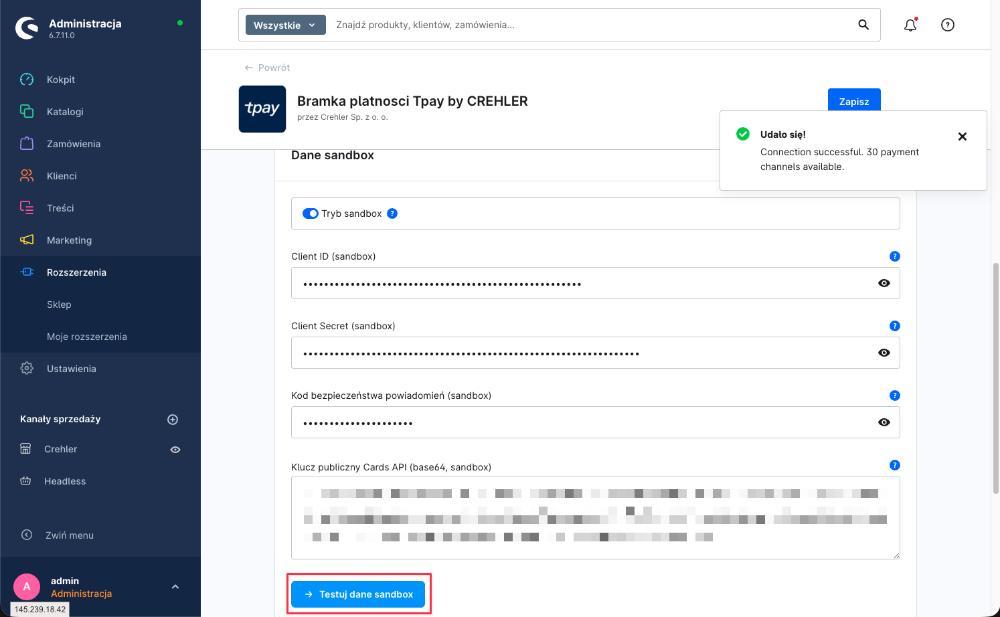

---

## Krok 3 — Przypisz płatności do kanału sprzedaży

Aby metody Tpay (BLIK, karta, przelew) były widoczne w checkout, muszą być **aktywne** i **przypisane do kanału sprzedaży**.

### 3a. Aktywuj metody płatności

**Ustawienia → Metody płatności** — upewnij się, że metody Tpay są aktywne (przełącznik **„Aktywny"**). Wtyczka dodaje trzy: **Karta**, **BLIK** i **Przelew online** — każda opisana „… Bramka płatności Tpay by CREHLER".

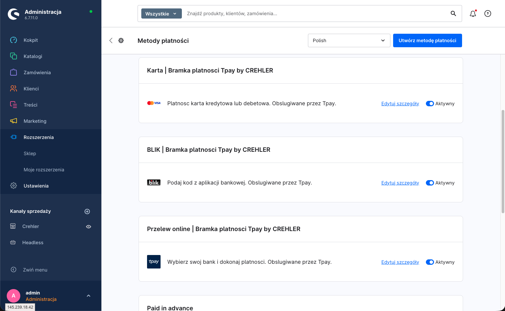

### 3b. Dodaj metody do kanału sprzedaży

W menu po lewej (sekcja **Kanały sprzedaży**) wybierz swój kanał (np. **Crehler**). W sekcji **Płatność i wysyłka** → pole **Metody płatności** dodaj metody Tpay, a w polu **Standardowa metoda płatności** możesz ustawić jedną z nich jako domyślną. Upewnij się też, że **Standardowa waluta** to **Złoty (PLN)**. Zapisz.

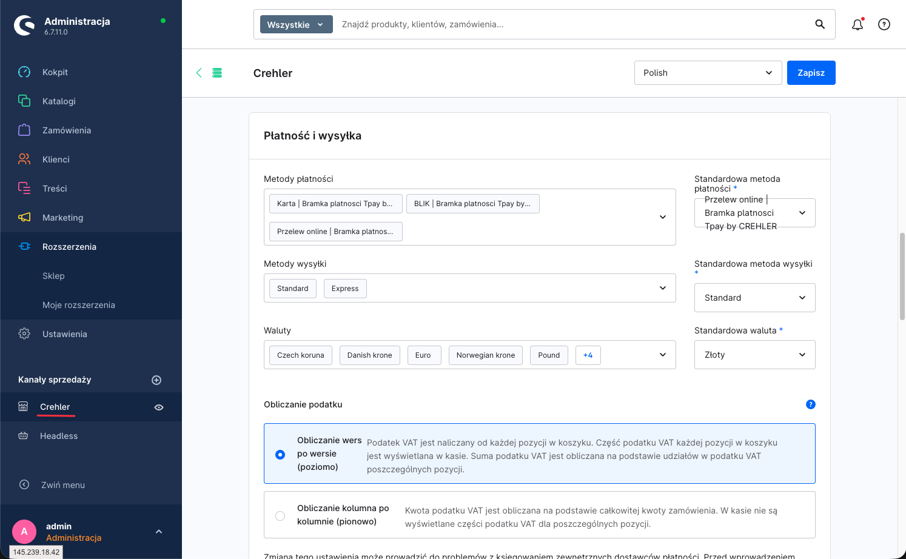

> 💡 Jeśli metoda nie pojawia się w checkout, sprawdź: czy jest aktywna (3a), czy dodana do kanału (3b), czy waluta koszyka to **PLN** oraz czy koszyk/kraj spełnia ewentualne reguły dostępności.

---

## Krok 4 — Konfiguracja płatności kartą

Wtyczka dokłada do konfiguracji kartę **Ustawienia wyświetlania** (wspólną dla wszystkich płatności Crehler). Tu decydujesz, jak wygląda płatność kartą i BLIK.

| Opcja | Działanie | Domyślnie |
|---|---|---|
| **Osadź formularz karty w checkout** | Wł.: pola karty pojawiają się **bezpośrednio w checkout** sklepu. Wył.: klient jest **przekierowany** na stronę płatności Tpay. | Wyłączone (przekierowanie) |
| **Pozycja pola kodu BLIK** | Gdzie pokazać pole na kod BLIK: *Na stronie potwierdzenia zamówienia* / *Na osobnej stronie po złożeniu* / *Ukryte (przekierowanie do bramki)*. | Na stronie potwierdzenia |
| **Opis transakcji** | Tekst wysyłany do bramki. Tokeny: `{{ orderNumber }}`, `{{ customerName }}`, `{{ salesChannelName }}`. | `{{ orderNumber }}` |

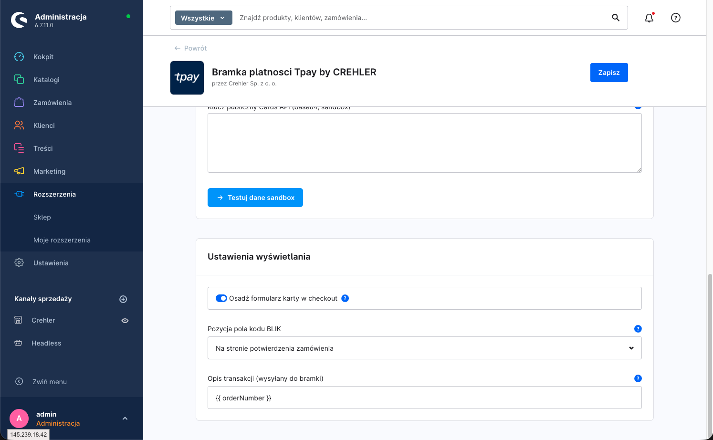

### Tryb domyślny: przekierowanie (zalecany)

Formularz karty jest hostowany przez Tpay. Klient wpisuje dane karty na stronie Tpay i wraca do sklepu. Najprostszy i najbezpieczniejszy wariant pod kątem zgodności (dane karty nigdy nie trafiają na Twoją stronę).

### Tryb osadzony: formularz karty w checkout

Po włączeniu **„Osadź formularz karty w checkout"** (i podaniu **klucza publicznego Cards API**) pola numeru karty, daty i CVC pojawiają się wprost w checkout. Dane są **szyfrowane po stronie przeglądarki** (RSA, kluczem publicznym Tpay) jeszcze przed wysyłką — do sklepu i do Tpay trafia już tylko zaszyfrowana wartość.

> 🔐 **Ważne — odpowiedzialność za zgodność (PCI DSS).** W trybie osadzonym **formularz karty jest częścią DOM Twojego sklepu** (pola i kod renderują się na Twojej stronie), a nie w izolowanej ramce hostowanej przez Tpay. Oznacza to, że to **Ty odpowiadasz za środowisko, w którym wpisywane są dane karty**, i obejmuje Cię szerszy zakres wymogów PCI DSS (typowo **SAQ A-EP** zamiast SAQ A właściwego dla rozwiązań w pełni hostowanych/iframe). W praktyce:
>
> - sklep musi działać po **HTTPS** na wszystkich stronach checkout,
> - **nie modyfikuj** kodu formularza karty ani sposób szyfrowania dostarczonego przez wtyczkę,
> - zadbaj o aktualizacje, nagłówki bezpieczeństwa (CSP) i ochronę przed wstrzyknięciem skryptów,
> - skonsultuj wymagany **typ SAQ** ze swoim agentem rozliczeniowym / Tpay.
>
> Jeśli nie chcesz przyjmować tej odpowiedzialności — zostaw **tryb przekierowania** (domyślny).

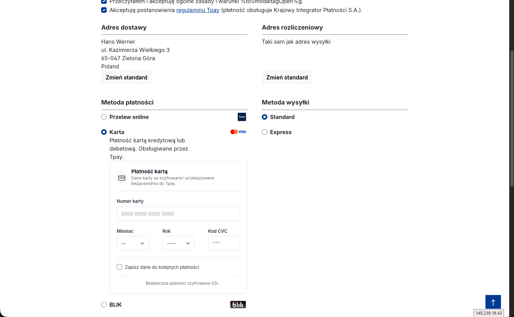

---

## Krok 5 — Test płatności

1. Włącz **Tryb sandbox** i zapisz konfigurację (Krok 2b).
2. Dodaj produkt do koszyka (waluta **PLN**) i przejdź do checkout.
3. Wybierz metodę Tpay (np. **BLIK**) i dokończ zamówienie zgodnie z instrukcjami konta testowego Tpay.
4. Sprawdź w panelu Shopware, czy status płatności zamówienia zmienił się na **Opłacone** po potwierdzeniu.

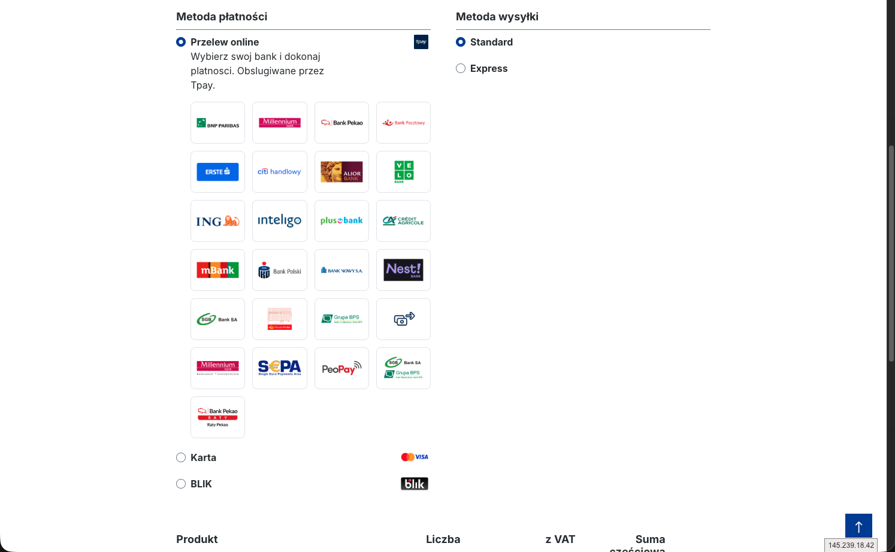

> ↩️ **Zwroty** wykonasz później z poziomu zamówienia w panelu Shopware — pełne lub częściowe, bez logowania do panelu Tpay. Szczegóły: [Zwroty płatności](zwroty.md).

---

## Dane testowe (sandbox)

### BLIK — kody testowe

- Kod testowy **musi zaczynać się od `777`** (np. `777654`).
- **Kwota** transakcji wymusza konkretną odpowiedź BLIK (symulacja statusów Polskiego Standardu Płatności), niezależnie od poprawności kodu — do testów ścieżek błędów:

| Kwota | Kod odpowiedzi | Znaczenie |
|---|---|---|
| `80,88` | `SUCCESS` / `AUTHORIZED` | płatność udana |
| `81,88` | `BAD_PIN` | błędny PIN |
| `82,88` | `INSUFFICIENT_FUNDS` | brak środków |
| `83,88` | `ISSUER_DECLINED` | odrzucone przez bank |
| `84,88` | `LIMIT_EXCEEDED` | przekroczony limit |
| `85,88` | `SEC_DECLINED` | odrzucone (bezpieczeństwo) |
| `86,88` | `SYSTEM_ERROR` | błąd systemu |
| `87,88` | `GENERAL_ERROR` | błąd ogólny |
| `88,88` | `RET_LATE` | zwrot po terminie |
| `89,88` | `RET_AMT_EXCEEDED` | przekroczona kwota zwrotu |
| `90,88` | `ALIAS_DECLINED` | odrzucony alias (zapamiętany BLIK) |
| `91,88` | `TIMEOUT` | przekroczony czas |
| `92,88` | `OFFUS_NOT_ALLOWED` | transakcja OFFUS niedozwolona |
| `93,88` | `ISS_OUTOFSERVICE` | bank niedostępny |
| `94,88` | — | brak odpowiedzi synchronicznej |

### Karta — numery testowe

Przykładowe karty testowe (16-cyfrowe), dowolna **przyszła** data ważności i dowolny kod **CVC**:

| Numer karty |
|---|
| `2223 0002 8000 0016` |
| `4056 2178 4359 7258` |
| `5204 7400 0000 1002` |
| `5457 2100 0200 1016` |
| `4012 0010 3714 1112` |

**Zachowanie 3-D Secure zależy od ostatniej cyfry kwoty:**

| Końcówka kwoty | Zachowanie |
|---|---|
| `…1` | frictionless (bez dodatkowej weryfikacji 3DS) |
| `…3` | udane powiadomienie metody (method notification) |
| `…5` | nieudane powiadomienie metody |
| `…6` | transakcja odrzucona |
| pozostałe | wymagane wyzwanie 3DS (challenge) |

**Kwoty wymuszające błąd** (dla wszystkich kart): `500.00`, `501.00`, `503.00`.

### Przelew (pay-by-link)

W sandboxie wybierasz bank tak jak na produkcji. Płatność porzucona pozostaje w statusie **oczekującym** — banki nie raportują porzucenia transakcji (zachowanie jak na produkcji).

> ℹ️ Dane testowe pochodzą z dokumentacji Tpay i mogą się zmieniać. Aktualną, pełną listę znajdziesz na **[support.tpay.com → Środowisko testowe (sandbox)](https://support.tpay.com/sprzedawca/srodowisko-testowe-sandbox)**.

---

## Powiązane artykuły

- **[Integracja przez Store API (headless)](store-api.md)** — endpointy Store API (BLIK Level 0, sub-metody banków, sprawdzanie statusu) i przykłady użycia.
- **[Zwroty płatności](zwroty.md)** — pełne i częściowe zwroty z poziomu panelu Shopware.

---

## Wsparcie

Masz pytanie lub problem z konfiguracją? Napisz do nas: **[support@crehler.com](mailto:support@crehler.com)**

Bramka płatności <strong>Tpay by CREHLER</strong> · <a href="https://crehler.com/">crehler.com</a>

