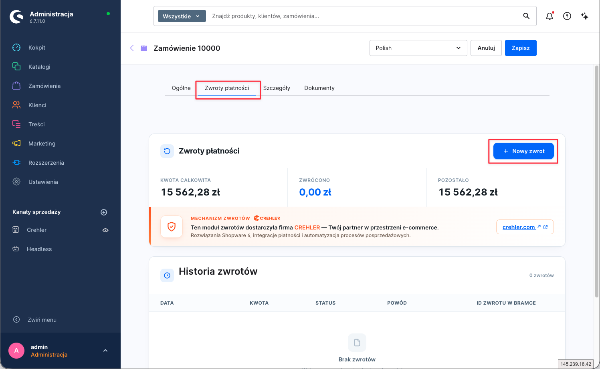
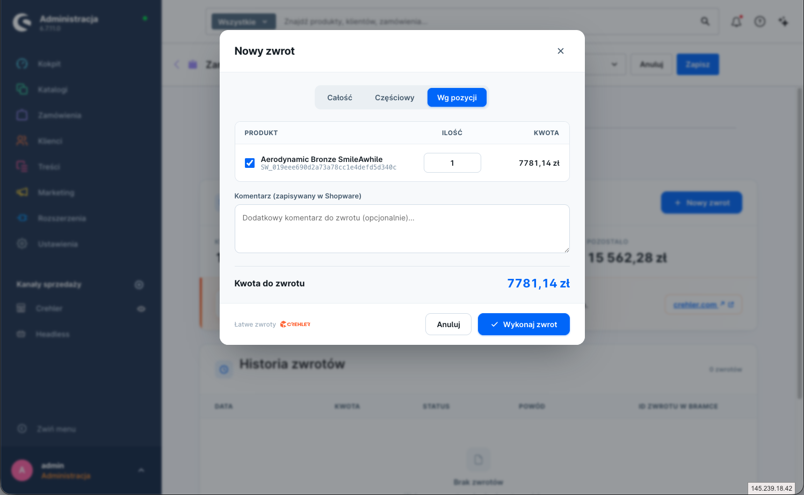
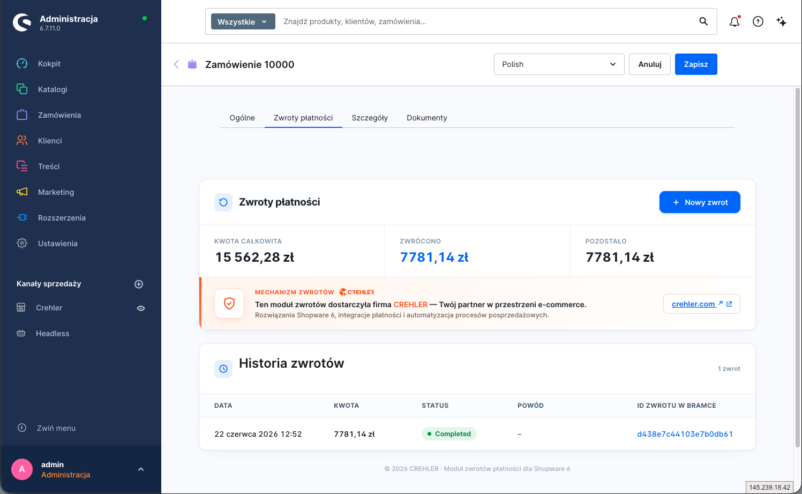

  

<h1 align="center">Zwroty płatności Tpay</h1>

Pełne i częściowe zwroty pieniędzy klientowi — wykonywane wprost z panelu Shopware, bez logowania do panelu Tpay.

---

> 📄 Konfigurację wtyczki opisuje [główna instrukcja](index.md). Ten dokument dotyczy zwracania środków za opłacone zamówienia.

## Jak to działa

Zwroty są obsługiwane przez **uniwersalny moduł „Zwroty płatności"** dostarczany przez `CrehlerPaymentBundle` i osadzony w **widoku zamówienia** w panelu administracyjnym. Operator inicjuje zwrot w Shopware, a wtyczka Tpay wysyła go do bramki przez API Tpay. Obsługiwane są zwroty **pełne i częściowe**, a do jednej transakcji możesz wykonać **wiele zwrotów** w czasie.

## Wymagania

- Zamówienie musi być **opłacone** przez Tpay.
- Klucz **Open API** użyty w konfiguracji wtyczki musi mieć uprawnienie **`ROLE_REFUND`** (panel Tpay: *Integracje → API → Klucze Open API* — przy kluczu widoczna lista uprawnień). Bez tego zwrot zostanie odrzucony przez bramkę.

## Jak wykonać zwrot

**1. Otwórz zamówienie i przejdź do modułu „Zwroty płatności".**
W panelu admina: **Zamówienia** → wybierz zamówienie → zakładka **„Zwroty płatności"**. Widzisz tu podsumowanie (kwota całkowita / zwrócono / pozostało) oraz historię zwrotów. Kliknij **„+ Nowy zwrot"**, aby rozpocząć.

**2. Wybierz zakres zwrotu.**
W oknie **„Nowy zwrot"** wybierz tryb: **Całość**, **Częściowy** (konkretna kwota) lub **Wg pozycji** (zaznacz produkty i ilości). Opcjonalnie dodaj **Komentarz** (zapisywany w Shopware). U dołu zobaczysz wyliczoną **Kwotę do zwrotu**.

**3. Wykonaj zwrot.**
Kliknij **„Wykonaj zwrot"**. Zwrot zostaje wysłany do Tpay, a jego stan zmienia się automatycznie w miarę przetwarzania.

## Statusy zwrotu

Zwrot ma własny cykl życia (niezależny od statusu samej transakcji):

| Status | Znaczenie |
|---|---|
| **Otwarty** (open) | Zwrot utworzony, jeszcze nieprzetworzony |
| **W toku** (in progress) | Wysłany do bramki, oczekuje na realizację |
| **Zakończony** (completed) | Środki zwrócone klientowi |
| **Nieudany** (failed) | Bramka odrzuciła zwrot |
| **Anulowany** (cancelled) | Zwrot wycofany przed realizacją |

Po zsumowaniu zwrotów status **zamówienia** odzwierciedla „zwrócone" / „częściowo zwrócone".

## Zwroty częściowe i wielokrotne

Możesz zwrócić część kwoty, a później kolejną — aż do sumy nieprzekraczającej wartości opłaconej transakcji. Każdy zwrot jest osobnym wpisem z własnym statusem, kwotą, powodem i datą, co daje czytelny audyt „co, kiedy i ile" zostało zwrócone.

## Zwroty wykonane w panelu Tpay

Jeśli zwrot zostanie wykonany **ręcznie w panelu Tpay** (poza sklepem), wtyczka odbierze powiadomienie (webhook) i **zsynchronizuje** stan zwrotu w Shopware, aby widok zamówienia pozostał spójny.

## Uwagi

- Zwrot nie cofa samej wysyłki/zamówienia — to wyłącznie zwrot **środków**.
- Czas zaksięgowania zwrotu po stronie banku/operatora zależy od Tpay i banku klienta.

---

## Wsparcie

Problem ze zwrotem? Napisz do nas: **[support@crehler.com](mailto:support@crehler.com)**

Bramka płatności <strong>Tpay by CREHLER</strong> · <a href="https://crehler.com/">crehler.com</a>

